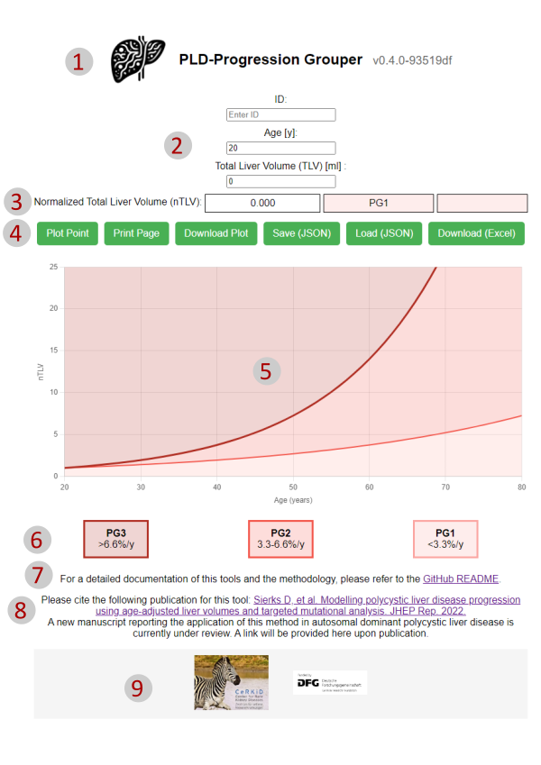

    

# PLD-Progression Grouper

Please explore the [PLD-Progression Grouper](https://halbritter-lab.github.io/pld-progression-grouper/) app hosted on GitHub pages.

## Introduction

"Polycystic Liver Disease (PLD) - Progression Grouper" is an interactive web application designed to assist in the prognostic assessment of Autosomal Dominant Polycystic Liver Disease (ADPLD) and PLD within the context of Autosomal Dominant Polycystic Kidney Disease (ADPKD). Based on two recents studies titled "Sex, genotype, and liver volume progression as risk of hospitalization determinants in autosomal dominant polycystic liver disease" and "Modelling polycystic liver disease progression using age-adjusted liver volumes and targeted mutational analysis" (PMID: 36246085), this tool aims to facilitate the visualization of disease progression and estimates the future risk of liver-related hospitalization in individuals with PLD.

PLD, characterized by numerous fluid-filled cysts arising from intrahepatic biliary epithelia, is a mostly genetic cholangiopathy with significant clinical heterogeneity. The application leverages data from a single-center and a multicenter study to introduce novel clinical endpoints, such as normalized age-adjusted total liver volume (nTLV) and PLD-related hospitalization, for prognostic risk stratification.

## References

The principle of the "PLD-Progression Grouper" tool has been first published in 2022, highlighting its application in the study of PLD within the context of both Autosomal Dominant Polycystic Kidney Disease (ADPKD) and Autosomal Dominant Polycystic Liver Disease (ADPLD). This underscores the tool's relevance and adaptability for assessing PLD progression not only in isolated cases but also when it occurs in conjunction with ADPKD. For more details on the publication, see [PMID:36246085](https://pubmed.ncbi.nlm.nih.gov/36246085/).

## Features

- **Data Input and Visualization:** Users can input individual-specific data, including age and total liver volume, to visualize the normalized total liver volume (nTLV) on a chart.
- **Trend Analysis:** The app plots two key trend lines based on the formulas derived from the study, offering visual insight into the progression groups as defined in the research.
- **Dynamic Interaction:** Users can interactively plot new data points on the chart, assisting in the analysis of individual individual trajectories.
- **Download and Print Options:** The application allows for downloading the plotted chart and printing the page for offline analysis and record-keeping.

## Technical Overview

The application is built using Vue.js and Chart.js, ensuring a responsive and interactive user experience. The layout is designed with controls and input fields on the left and the chart on the right, facilitating ease of use and clear data presentation.

## Webapp usage and application components

    

1. **Application Header**
   - **(1a) Logo**: Displays the logo of the PLD-Progression Grouper application.
   - **(1b) Title**: Shows the name of the application.
   - **(1c) Version Tag**: Indicates the current version of the application.

2. **User Input Area**
   - **(2a) ID Field**: Where users can enter a unique identifier for the data point they are entering or analyzing.
   - **(2b) Age Input**: Users can input the age of the patient in years.
   - **(2c) Total Liver Volume (TLV) Input**: Users can input the total liver volume measured in milliliters.

3. **Computed Outputs**
   - **(3a) Normalized Total Liver Volume (nTLV)**: This field displays the calculated normalized total liver volume based on the input TLV.
   - **(3b) Progression Group (PG) Indicator**: Shows the progression group classification based on the computed nTLV and age.

4. **Action Buttons**
   - **(4a) Plot Point**: Submits the entered data and plots the point on the graph.
   - **(4b) Print Page**: Allows the user to print the current page.
   - **(4c) Download Plot**: Enables the user to download the displayed plot as an image.
   - **(4d) Save (JSON)**: Saves the current data table into a JSON file.
   - **(4e) Load (JSON)**: Loads data from a selected JSON file and updates the table and plot accordingly.
   - **(4f) Download (Excel)**: Exports the data table into an Excel spreadsheet.

5. **Chart Area**
   - Displays a scatter plot graph illustrating the relationship between age and nTLV, with trend lines indicating progression thresholds.

6. **Progression Group Legend**
   - **(6a) PG3**: Indicates rapid progression (greater than 6.6% per year).
   - **(6b) PG2**: Indicates moderate progression (between 3.3% and 6.6% per year).
   - **(6c) PG1**: Indicates slow progression (less than 3.3% per year).

7. **Documentation Link**
   - Provides a link to the GitHub README for detailed documentation of the application and its methodologies.

8. **Citation Information**
   - Contains bibliographic information to cite when using the application for research or publication purposes.

9. **Footer**
   - **(9a) Institution Logo**: Shows the logo of the associated medical institution.
   - **(9b) Funder Logo**: Displays the logo of the funding organization.

10. **Data Table** *(not visible in the screenshot)*
   - If present, this would display a table of all data points entered, including ID, age, TLV, nTLV, progression group, and an option to remove data points.

Each numbered item refers to a different component or section of the app. Users interact with these components to input data, receive computed outputs, manage the data points, and utilize the results for further analysis or documentation.

## URL API Documentation

### Overview
The PLD-Progression Grouper tool supports URL query parameters, allowing users to preset input fields directly through the URL. This feature enables easy sharing of specific configurations and faster access to the tool with predefined settings.

### Query Parameters
The tool accepts the following query parameters:

1. `patientId`: Sets the patient's ID.
2. `age`: Sets the patient's age.
3. `tlv`: Sets the Total Liver Volume (TLV) in milliliters.
3. `acknowledgeBanner`: Sets the banner acknowledgement state. Accepts `true` or `false`.

### Usage Examples
- **Setting Patient ID and Age**: 
This URL sets the patient's ID to "12345" and age to "50".
https://halbritter-lab.github.io/pld-progression-grouper/?patientId=12345&age=50

- **Setting All Parameters**:
This URL sets the patient's ID to "12345", age to "50", and Total Liver Volume to "15000 ml" and acknowledges the banner.
https://halbritter-lab.github.io/pld-progression-grouper/?patientId=12345&age=50&tlv=15000&acknowledgeBanner=true

## Limitations and Relevance

While the tool is based on a large cohort study, it's important to acknowledge the limitations in generalizability due to the cohort size. The tool serves a research purpose, offering a new approach to understanding the progression of ADPLD and assisting in decision-making for individuals with PLD.

## Contributions

This tool is an open-source project, and contributions are welcome. Whether it's feature enhancement, bug fixing, or improvements in the algorithm, your input is valuable.

## Citation policy

- Please cite the following publication for this tool: [ Sierks D, et al. Modelling polycystic liver disease progression using age-adjusted liver volumes and targeted mutational analysis. JHEP Rep. 2022.](https://pubmed.ncbi.nlm.nih.gov/36246085/)
- A new manuscript reporting the application of this method in autosomal dominant polycystic liver disease is currently under review. A link will be provided here upon publication.

## Copyright and license

- All code from this project is licensed under the "MIT No Attribution" (MIT-0) License.  For more information, please refer to the [License](LICENSE.md) file.

## Creators and contributors

**Bernt Popp**

- <https://twitter.com/berntpopp>
- <https://github.com/berntpopp>
- <https://orcid.org/0000-0002-3679-1081>
- <https://scholar.google.com/citations?user=Uvhu3t0AAAAJ>

**Ria Schönauer**

- <https://github.com/RARSchoen>
- <https://orcid.org/0000-0001-7609-3061>

**Dana Sierks**
- <https://github.com/SIERKSd>
- <https://orcid.org/0000-0002-3850-7646>

**Jan Halbritter**

- <https://github.com/halbrijp>
- <https://orcid.org/0000-0002-1377-9880>
- <https://scholar.google.com/citations?user=Jt1S5fkAAAAJ>

## Contact

If you have any questions, suggestions, or feedback, please feel free to [contact us](contact.md).
